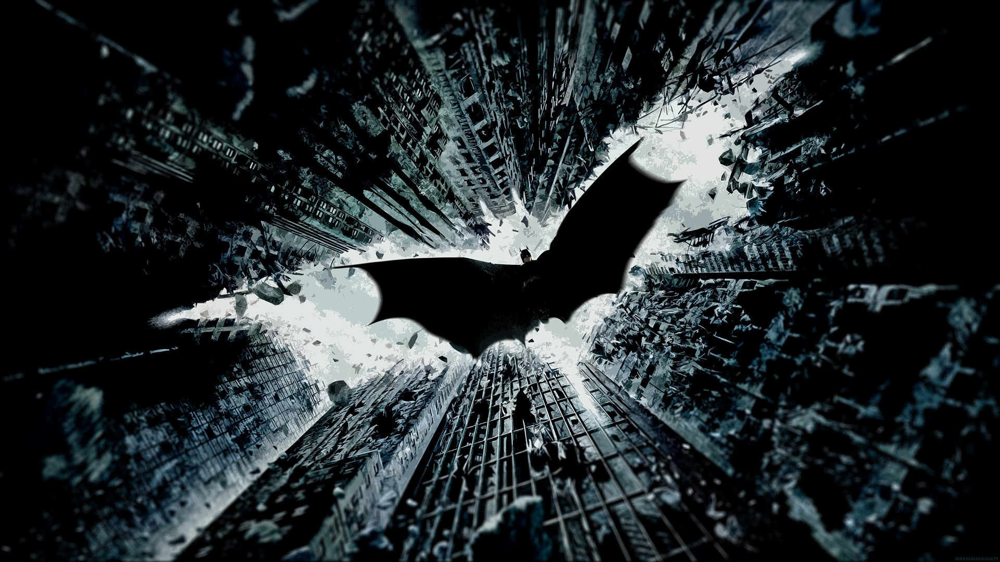

# image color transfer

  

# Requirements:
1. OpenCV
2. numpy

# Usage:
<b><code>python parse.py --source "path to the source image" --target "path to the target image" --output "path to the output image</code></b>

### --output is optional
